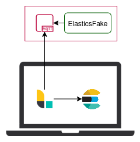

<div align="center">

<h1>
  <span style="color: #3870a0; background: #fed545">Elastics</span><span style="color: #fed545; background: #3870a0;">Fake<span>
</h1>


**Lightweight DIY log collector that emulates Elasticsearch for Beats agents**

Perfect for home labs, IoT setups, or personal experiments — collect logs reliably without an always-on Elasticsearch cluster.

</div>


- Accept logs from Beats agents (Elastic Agent, Filebeat, etc.).
- Save logs locally or forward them to your preferred log storage solution.
- Acts as a shim for Elasticsearch: agents think they are talking to a real ES cluster.
- Lightweight and easy to deploy on Raspberry Pi 3/4 or any mini-PC.


## Key points / highlights

- ✅ Elasticsearch-compatible shim for \_bulk requests.
- ✅ Local storage – no backend required.
- ✅ Runs on minimal hardware – Raspberry Pi or mini-PC.
- ✅ DIY / open-source – you can tweak it to your needs.


## Usage/Installation

### Local app run

```
cd elasticsfake
pip install -r requirements.txt
CONFIG_FILE_PATH=config.yaml python main.py

# Example output:
# INFO:     Started server process [32111]
# INFO:     Waiting for application startup.
# INFO:     Application startup complete.
# INFO:     Uvicorn running on http://0.0.0.0:9200 (Press CTRL+C to quit)

```

### Ansible Installation

To install in a raspberry-pi or other Debian based compatible distribution you can run
the ansible playbook located in this repository.

Create an inventory file under ansible/ folder.
Example of mine:

```
[logs_box]
192.168.1.9 ansible_user=snakecase
```

Run the ansible playbook.

```bash
pip install ansible
ansible-playbook -i inventory playbook.yml
```

## Service configuration examples

In this POC version of the project there is no support yet for authentication, HTTPs or compression.
This support can be added either updating the code or adding an nginx on top of it.

### ElasticsAgent configuration

```
outputs:
  default:
    type: elasticsearch
    hosts: ["http://192.168.1.9:9200"]
    compression_level: 0
```

### Logstash

```
output {
  elasticsearch {
    hosts => ["http://192.168.1.9:9200"]
    manage_template => false
    http_compression => false
  }
}
```

## What Happens After Data Collection

Data handling after collection is beyond the scope of this project.



In my current setup, logs are collected by Elasticsfake on a Raspberry Pi®,
and when I start my laptop, Logstash retrieves them from MQTT and injects
them into Elastics. This avoids running Elastics continuously while still
allowing analysis of activity from all my devices.


## Why did I developed this?

- I want to have my own **family&friends SIEM** but I don't want to have a big resource hungry machine
  constantly connected.
- I considered using **Logstash with an Elasticsearch input** but also consumes significant resources.
- I know it might feel like reinventing the wheel, but I couldn’t find a **lightweight, extendable Elasticsearch shim**
  for Beats agents that fit my needs.

## Why you may want to use this project?

- Easy to tweak and extend — make it fit your own setup.
- Maybe my use case clicks with yours, and you also want a lightweight Elasticsearch buffer for your logs.
- Maybe you don’t run Elasticsearch, but you’ve got an agent that speaks Elasticsearch and has the exact data
  you need — this project can act as a tiny adapter for your own datastore.
- Or maybe… you just don’t need it. I’m not selling it to anyone, so no hard pitch here.
  Use it if it fits your project or curiosity. Skip it if not. 😂

## About the Author

Hey! I’m Samuel — cybersecurity enthusiast, developer, magician and ham radio hobbyist.

If you want to connect or see what I’m up to, check out my [LinkedIn](https://www.linkedin.com/in/sam-sec/)
